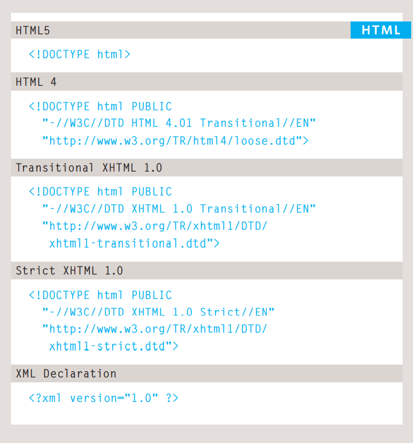

# How People Access the Web
* Browsers
 > People access websites using 
software called a web browser. 
Popular examples include 
Firefox, Internet Explorer, Safari, 
Chrome, and Opera.
* Web Servers
> When you ask your browser for 
a web page, the request is sent 
across the Internet to a special 
computer known as a web 
server which hosts the website.

* Screen readers
>
>Screen readers are programs 
that read out the contents of a 
computer screen to a user. They 
are commonly used by people 
with visual impairments

# How Websites are created?
All websites use HTML and CSS, but content 
management systems, blogging software, and 
e-commerce platforms often add a few more 
technologies into the mix.

HTML pages are text documents.
> HTML uses tags (characters that sit inside angled 
brackets) to give the information they surround special 
meaning.
> Tags are often referred to as elements.
> Tags usually come in pairs. The opening tag denotes 
the start of a piece of content; the closing tag denotes 
the end.
> Opening tags can carry attributes, which tell us more 
about the content of that element.
> Attributes require a name and a value.
> To learn HTML you need to know what tags are 
available for you to use, what they do, and where they 
can go.

# HTML Versions 

If you want to add a comment 
to your code that will not be 
visible in the user's browser, you 
can add the text between these 
characters:

< !-- comment goes here -->

> The <id> and class attributes allow you to identify 
particular elements.

> The div and span elements allow you to group 
block-level and inline elements together.
 
> <iframes> cut windows into your web pages through 
which other pages can be displayed.
 
> The <meta> tag allows you to supply all kinds of 
information about your web page.
 
> Escape characters are used to include special 
characters in your pages such as <, >, and ©.

## Javascript 

*javaScript (or "JS") is a programming language used most often for dynamic client-side scripts on webpages,
but it is also often used on the server-side, using a runtime such as Node.js*

Thing we can do with javascript
 * ACCESS CONTENT 
You can use JavaScript to select any 
element, attribute, or text from an 
HTML page
 * You can use JavaScript to add 
elements, attributes, and text to the 
page, or remove them.
 * You can specify a set of steps for 
the browser to follow (like a recipe), 
which allows it to access or change the 
content of a page.
 * REACT TO EVENTS 
You can specify that a script should run 
when a specific event has occurred

------------------------------------------------------------------------------------------------------------------------
## What is a script and how do I create one?
> A script is a series of instructions that a 
computer can follow to achieve a goal.

To write a script, you need to first 
state your goal and then list the 
tasks that need to be completed in 
order to achieve it.

## OBJECTS 
In computer programming, each physical thing in 
the world can be represented as an object.
There are two different types of objects here: a hotel and a car. 
Programmers might say that there is one instance of 
the hotel object, and two instances of the car object. 
Each object can have its own:

* Properties 
* Events 
* Methods

### 1- PROPERTIES (CHARACTERISTICS) 
Both of the cars share common characteristics. 
In fact, all cars have a make, a color, and engine 
size. You could even determine their current 
speed. Programmers call these characteristics the 
properties of an object. 
Each property has a name and a value, and each of 
these name/value pairs tells you something about 
each individual instance of the object

### 2-WHAT IS AN EVENT? 
There are common ways in which people interact 
with each type of object. For example, in a car a 
driver will typically use at least two pedals. The car 
has been designed to respond differently when the 
driver interacts with each of the different pedals: 
* The accelerator makes the car go faster 
* The brake slows it down 

WHAT DOES AN EVENT DO? 

Programmers choose which events they respond to. 
When a specific event happens, that event can be 
used to trigger a specific section of the code. 

### 3- Methods represent things people need to do with objects. They can 
retrieve or update the values of an object's properties.

